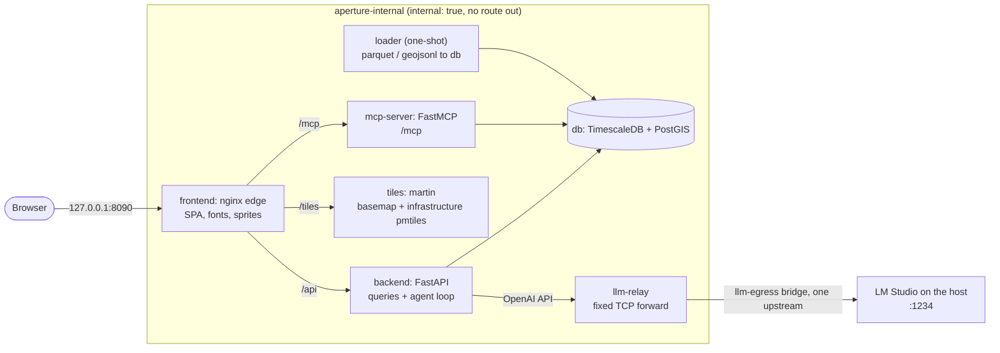

# Aperture

An offline OSINT fusion workstation for the airspace within 50 miles of Washington, DC. It combines
one day of ADS-B flight tracks (2026-09-24, 3,101 aircraft, 8.8 M positions) with OpenStreetMap
infrastructure (airports, ports, government, military) on a vector map. A local LLM agent answers
questions with the same tools the UI uses: "which aircraft entered a 1 km buffer around DCA, and
when?"

**Everything runs locally, CI included.** Networking is confined to one-time bootstrap (fetch the
data snapshot, build the dependency images). After that, no running component can reach the
internet, and each phase gate proves it with egress probes that must fail.

- Map: MapLibre with a Protomaps basemap and infrastructure overlays, aircraft tracks, a time
  scrubber/replay, and a UTC/ET toggle.
- Geofences: draw a polygon or buffer a feature to get entry/exit times for every aircraft; export
  findings with provenance.
- Chat: `qwen/qwen3.5-9b` in LM Studio, tool calling over `search_entities`, `get_entity_track`
  and `geofence_alert`; renders Markdown and draws its results on the map.
- MCP: the same three tools over streamable HTTP (`/mcp`) or stdio, for Claude Code or any MCP
  client.

## Architecture



- **Tool registry:** `backend/aperture_api/tools.py` defines the tools once. The agent calls them
  in-process; `mcp-server` is a thin adapter over the same registry.
- **Data in the images:** the loader and tiles images carry the snapshot. No image fetches data
  at runtime.
- **The LLM relay:** the only bridge out. It forwards TCP to a single fixed upstream (LM Studio)
  and nothing else.
- **The same stack on Kubernetes:** `helm/aperture` (minikube). Default-deny egress
  NetworkPolicies take the place of Docker's internal network, and every pod runs with
  `imagePullPolicy: Never`.

## Offline guarantees and how they are proven

| Claim | Mechanism | Proven by |
|---|---|---|
| App containers cannot reach the internet or the Docker host | `aperture-internal` is `internal: true` | Gates 1–3: probes to 1.1.1.1, example.com and host:1234 fail from a probe container on the network and from backend, mcp-server and tiles |
| The edge never uses its route out | nginx upstreams are internal service names only; no `resolver` | Gate 3: config audit, plus the edge's socket table after the Playwright run |
| The browser loads nothing off-origin | fonts, sprites and tiles are served by the edge | Gate 3: Playwright fails on any off-origin request or console error |
| The LLM path reaches LM Studio and nothing else | backend and mcp-server reach only the relay; the relay forwards to one fixed upstream | Gate 2: backend/mcp-server egress blocked. Gate 3: relay upstream audit. Gate 4: the relay's own egress to the internet blocked by NetworkPolicy. (In Compose the relay needs an ordinary bridge to reach the host, so there its guarantee is the single-upstream code, not the network.) |
| The same holds on Kubernetes | default-deny egress NetworkPolicies; images copied in, never pulled | Gate 4: probe pod plus per-service egress probes, all pods `imagePullPolicy: Never` |
| Builds download nothing | Dockerfiles are `FROM` prebuilt deps images; `network: none` | Gate 4 and CI `build`: every app image built with `--network=none` |
| CI is offline | Gitea, the runner and all job containers on the internal `aperture-ci` network; no `uses:` | Gate 5: `egress-check` job on every run, plus an audit of Gitea's `app.ini` |
| Networked code is fenced | network clients may be imported only in `data/snapshot/`, `bootstrap/` and the backend's LM Studio client | `scripts/lint_network.py` (Gate 0 and CI `lint`) |

Accepted limitation: LM Studio runs on the host, outside any container, so it is not
isolation-tested.

## Quick start

**Prerequisites**
- Windows 11 with Docker Desktop, Git Bash, [uv](https://docs.astral.sh/uv/) and Python 3.14.
- LM Studio serving `qwen/qwen3.5-9b` on `:1234` (for chat).
- Optional: minikube 1.39 and Helm 4.3 for Gate 4.

**Bootstrap (networked, once).** Every pinned image is listed in
[bootstrap/images.lock](bootstrap/images.lock).

```bash
# 1. data snapshot (~4.9 GB of downloads outside the repo); see data/snapshot/README.md
uv run python data/snapshot/fetch_adsb.py download && uv run python data/snapshot/fetch_adsb.py filter
uv run python data/snapshot/fetch_osm.py && uv run python data/snapshot/fetch_basemap.py
uv run python data/tiles/bake.py
# 2. dependency and CI job images, one per lockfile
uv run python bootstrap/build_deps.py
```

**Run (offline from here on).**

```bash
docker compose up -d --build        # db, loader (one-shot), backend, mcp-server, tiles, relay, edge
# open http://localhost:8090
```

**Tests.**

```bash
docker compose --profile test up -d db-test && uv run pytest -q   # Python, against the fixtures DB
cd frontend && npm test                                           # vitest
uv run python scripts/verify.py phase3                            # full stack + Playwright e2e
```

### Kubernetes (minikube)

One-time, networked: this pulls the node image, Kubernetes and Calico.

```bash
minikube start -p aperture --driver=docker --cpus=6 --memory=12g --cni=calico
```

Then offline:

```bash
uv run python scripts/k8s.py up     # copy local images into the node, helm upgrade --install, wait
kubectl -n aperture port-forward svc/frontend 8090:8080
```

The cluster is sized at 6 CPU and 12 GB of memory for TimescaleDB, with the full day of positions
and the app services. LM Studio runs on the host, outside that budget.

### Local CI and the GitHub mirror

- **Gitea is canonical.** Every push runs
  [.gitea/workflows/ci.yml](.gitea/workflows/ci.yml): egress-check, lint, typecheck, test, web,
  helm, then build.
- **Setup:** see [ci/README.md](ci/README.md). Accounts and tokens are created by hand in the
  Gitea UI.
- **Mirror to GitHub:** Gitea has no route out, so it cannot push-mirror. The mirror runs from
  your machine instead, and only for commits whose Gitea run is green:

  ```bash
  uv run python scripts/mirror.py            # gitea/main -> github main (fast-forward only)
  uv run python scripts/mirror.py --dry-run
  ```

## Phase gates

`uv run python scripts/verify.py phaseN` runs the checks for phase N and exits non-zero on any
failure. Evidence is written to `.verify/`.

| Gate | Proves |
|---|---|
| `phase0` | Snapshot artifacts match `MANIFEST.json` (sha256, sizes, counts); network-import lint |
| `phase1` | DB, loader and API up on the internal network; egress blocked; API answers match golden JSON |
| `phase2` | Agent and MCP answers checked against independent SQL ground truth (geofence and track questions), through the relay |
| `phase3` | Edge audit, Playwright e2e (map, geofence, replay, chat, Markdown, resizable panel), no off-origin requests |
| `phase4` | Same app on minikube: NetworkPolicy egress probes, golden answers, chat through the relay |
| `phase5` | Gitea and runner isolated and configured offline; pushes HEAD and requires a green run with egress and build evidence |

## Data provenance and licenses

The snapshot is gitignored; [data/snapshot/MANIFEST.json](data/snapshot/MANIFEST.json) pins each
source (URL, release, sha256, row counts). Small committed subsets in `data/fixtures/` drive the
tests.

| Data / asset | Source | License |
|---|---|---|
| ADS-B positions and aircraft (2026-09-24) | [adsb.lol](https://adsb.lol) `globe_history_2026`, release `v2026.09.24-planes-readsb-prod-0` | [ODbL 1.0](https://opendatacommons.org/licenses/odbl/1-0/) |
| Infrastructure overlays | © [OpenStreetMap](https://www.openstreetmap.org/copyright) contributors, via [Geofabrik](https://download.geofabrik.de/) extracts (DC, MD, VA, WV) | ODbL 1.0 |
| Basemap tiles | [Protomaps](https://protomaps.com) daily build 20260924: OpenStreetMap data | ODbL 1.0 |
| Map fonts (Noto Sans) | [protomaps/basemaps-assets](https://github.com/protomaps/basemaps-assets) @ `028c18f` | SIL OFL 1.1: [docs/licenses/noto-fonts-OFL.txt](docs/licenses/noto-fonts-OFL.txt) |
| Map sprites | basemaps-assets, derived from [tangrams/icons](https://github.com/tangrams/icons) | MIT © Mapzen: [docs/licenses/tangrams-icons-MIT.txt](docs/licenses/tangrams-icons-MIT.txt) |

**How the licenses are met:**
- **Attribution in the app:** the map shows OpenStreetMap, Protomaps and adsb.lol attribution,
  with links to the font and icon licenses. The edge serves those license files at `/licenses/`.
- **In exports:** findings exports carry the snapshot's provenance.
- **Derived databases are ODbL:** the parquet, GeoJSONL and PMTiles files are derived databases
  of ODbL sources. The loader, tiles and edge images contain them, so redistributing those images
  means offering those databases under ODbL. The repository itself contains only the committed
  test fixtures, which are likewise ODbL-derived.

No license is granted for Aperture's own source code: all rights reserved.

## Repository layout

```text
bootstrap/        networked: deps + CI job images, pinned images (images.lock)
data/             aoi.json, snapshot fetchers + MANIFEST.json (networked), tile baking, fixtures
db/               init SQL (extensions, schema) and the one-shot loader
backend/          FastAPI app: queries, tool registry, agent loop
mcp-server/       FastMCP adapter over the backend's tools
relay/            the fixed-upstream TCP relay to LM Studio
frontend/         React + MapLibre SPA and the nginx edge image
e2e/              Playwright tests (run in their own image, on the internal network)
helm/aperture/    the chart; scripts/k8s.py deploys it to minikube
ci/               Gitea + act_runner stack; .gitea/workflows/ci.yml is the pipeline
scripts/          verify.py (gates), ci.py, ci_build.py, mirror.py, lint_network.py
docs/licenses/    license texts for vendored map assets
```
